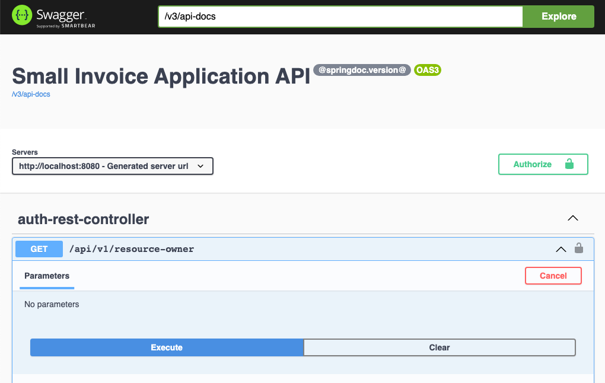
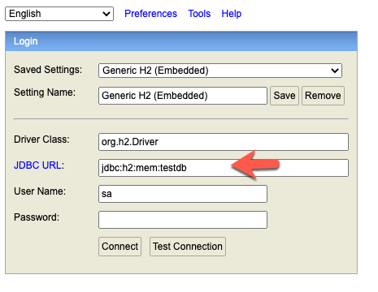

# Todo App Spring Boot Thymeleaf REST jQuery

A single page application by using JSON with jQuery.


## Overview

We will implement simple Rest Api whioch is calling the smallinvoice api through the smallinvoice api component:

[https://github.com/mbachmann/smallinvoice-api-parent](https://github.com/mbachmann/smallinvoice-api-parent)


<br/>

## Tools and Technology Stack

the project has been created by using IntelliJ Ultimate edition.
The technology stack consists of the following components:

- Spring Boot (Version 2.5)
- Java Persistence API
- Rest Controller
- H2 and MySQL (8.x) Database
- H2 Console
- OpenApi
- Docker and Docker Compose


## Starting the Application

After starting the application, you have several options:

Todo Application - Enter in Browser:

- [http://localhost:8080](http://localhost:8080) Open the _Todo App_ in the browser
- [http://localhost:8080/v3/api-docs](http://localhost:8080/v3/api-docs) The _Api-Docs_ in _JSON_ format
- [http://localhost:8080/v3/api-docs.yaml](http://localhost:8080/v3/api-docs.yaml) -> _yaml_ file is downloaded -> [https://editor.swagger.io/](https://editor.swagger.io/)
- [http://localhost:8080/swagger-ui.html](http://localhost:8080/swagger-ui.html) The _OpenApi_ Frontend
- [http://localhost:8080/h2-console](http://localhost:8080/h2-console)  -> mit Generic _H2_ (Embedded), _org.h2.Driver_, **jdbc:h2:mem:testdb** und sa

### OpenApi Frontend for API Testing

<br/>



<br/>

### H2 Console

<br/>



<br/>

## Creating and deploying a container

### Build run and publish the demo-smallinvoice-api project

Use a Mac, Linux, WSL2 or git bash console.

<br/>

```
git clone https://github.com/mbachmann/demo-smallinvoice-api
cd demo-smallinvoice-api
./mvnw clean package
java -jar target/demo-smallinvoice-api*.jar
```

<br/>

###  Create a Docker Container, Run and Publish to Docker

Create first a jar with the build instruction. To create a container. Replace **uportal** with your **dockerhub id**.

<br/>

```

$  docker build -t uportal/demo-smallinvoice-api .
$  docker run -p 8080:8080 --rm -it  uportal/demo-smallinvoice-api
```

<br/>

_Ctrl c_ will stop and delete the container.

<br/>

Replace **uportal** with your **dockerhub id**.

<br/>

```
$  docker login
$  docker login --username uportal --password 
$  docker push uportal/demo-smallinvoice-api
```
<br/>

Login to deployment platform with a container infrastructure:

<br/>

Replace **uportal** with your **dockerhub id**.

<br/>

```
$  docker pull uportal/demo-smallinvoice-api
```

<br/>

###  docker-compose

Start the files with:

<br/>

Start with log output in the console:

```
$  docker-compose -f docker-compose-h2.yml up
```

<br/>

Start in detached mode

```
$  docker-compose -f docker-compose-h2.yml up -d
```

<br/>

Delete containers:

```
$  docker-compose -f docker-compose-h2.yml rm
```

<br/>

### Create a Dockerfile

The Dockerfile takes a slim _JDK17 image_, adds the _demo-smallapi-api-*.jar_ file from the _target_ folder with the name _app.jar_. This jar file is started by _java -jar_ command.

<br/>

```dockerfile
FROM openjdk:17-jdk-slim

ADD target/demo-smallinvoice-api-*.jar app.jar

ARG JVM_OPTS
ENV JVM_OPTS=${JVM_OPTS}

CMD java ${JVM_OPTS} -jar app.jar


```

<br/>
